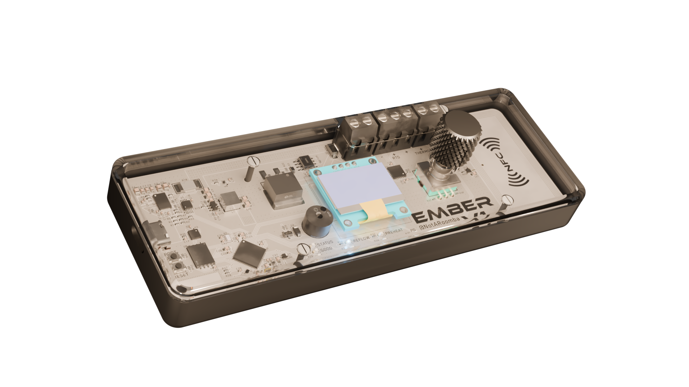
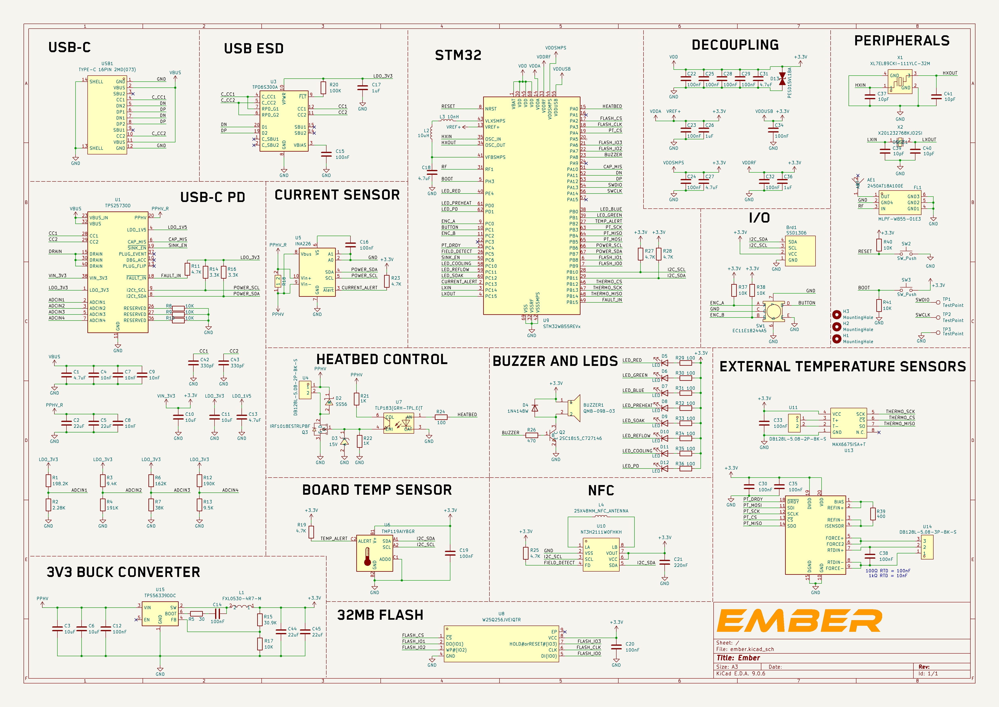
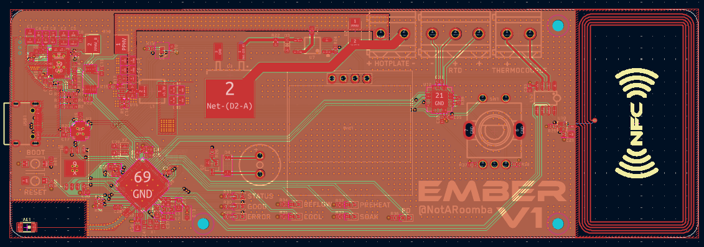
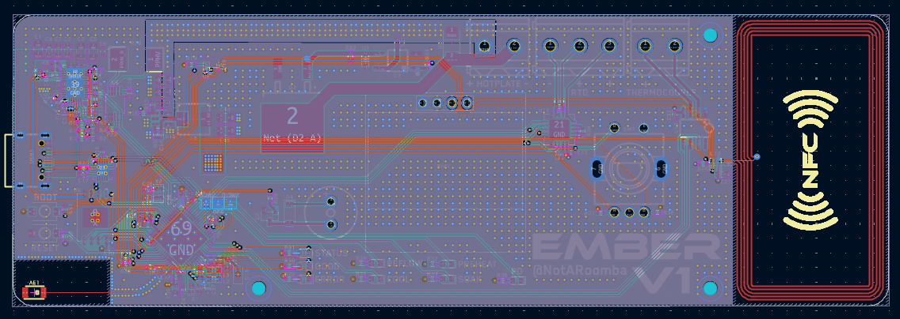
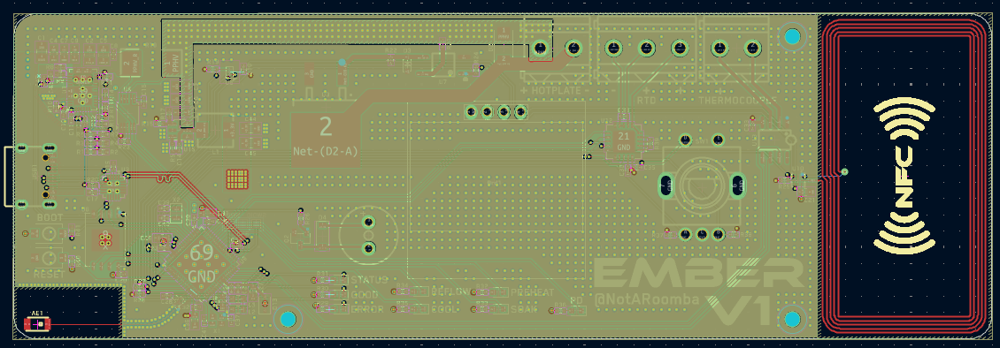
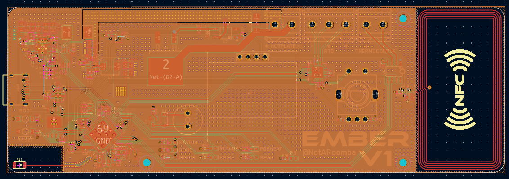
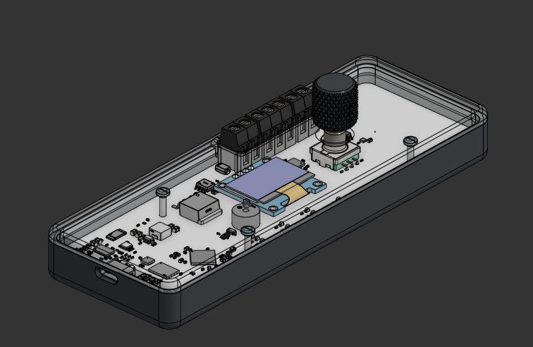
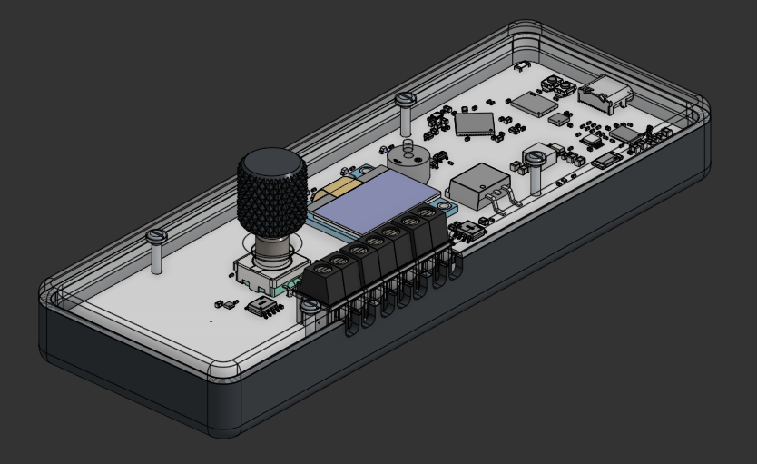
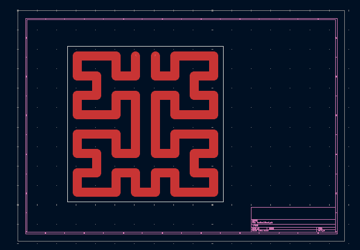
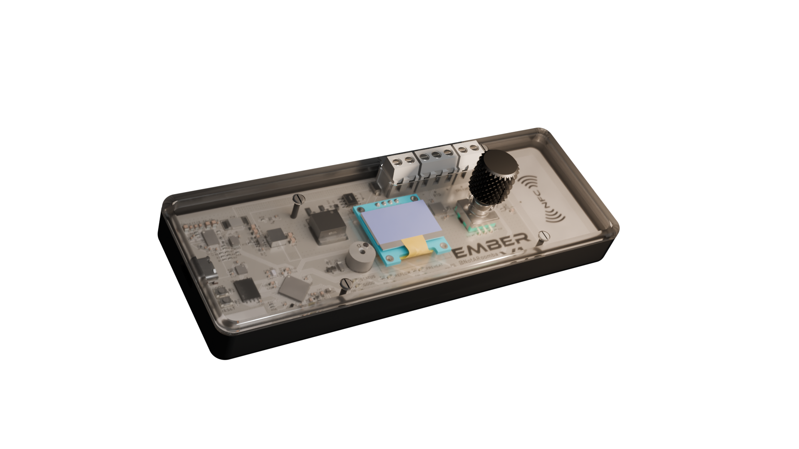

<h1 align="center">
   
  
   
  Ember
   
</h1>

<h4 align="center">
A high-performance USB-C powered reflow hotplate with Bluetooth connectivity and intelligent temperature control!
</h4>

  <a href="#key-features">Key Features</a> •
  <a href="#pcb">PCB</a> •
  <a href="#case">Case</a> •
  <a href="#heatbed">Heatbed</a> •
  <a href="#credits">Credits</a> •
  <a href="#license">License</a>

## Key Features

- **USB-C Power Delivery** up to 100W (20V) using TI's TPS25730D
- **STM32WB55CG** microcontroller with Bluetooth support
- **Large ~~400mm x 400mm~~ 200mm x 200mm flexible heatbed** for big PCB reflow
- **Dual temperature sensing** with MAX6675 thermocouple and PT1000 RTD
- **OLED display** with rotary encoder for easy control and preset management
- **NFC support** for wireless temperature profile transfer and preset storage
- **Gate driver** for precise PWM heatbed control
- **Current and board temperature monitoring** for safety
- **32MB Flash memory** for graphics and data storage
- **Portable design** with custom acrylic / nylon case

## PCB

Designed in KiCad!

### Schematic

### PCB Layout

**Front:**

**Back:**

**Ground Plane:**

**Power Plane:**

Board dimensions: 50mm x 150mm

## Case

Custom designed case in OnShape with practical features:

Features:
- **USB-C port cutout** with flush cable routing
- **Screw terminal access** for heatbed and temperature sensor connections
- **Heatset inserts** for secure assembly with slotted cylindrical head screws
- **High-quality materials**: PA11-HP Nylon base with acrylic top for visibility
- **Rounded corners** for aesthetics and safety

## Heatbed

The heatbed uses JLCPCB's flexible heater technology for cost-effective large-area heating.

The flexible heater connects to the main PCB via screw terminals and sits on an aluminum sheet with leg mounts to protect the work surface.

## 3D Renders

## Credits

This project uses:

- [KiCad](https://www.kicad.org/)
- [OnShape](https://www.onshape.com/) for case design
- [Blender](https://www.blender.org/) for 3D renders
- [STM32CubeMX](https://www.st.com/en/development-tools/stm32cubemx.html)
- Inspiration from [this reflow hotplate project](https://github.com/ikajdan/reflow-hot-plate)
- [Arduino GFX Tool](https://arduinogfxtool.netlify.app/) for OLED UI/UX design

## You may also like...

- [Cyberboard](https://github.com/NotARoomba/Cyberboard) – A Raspberry Pi Pico-sized STM32 development board with Bluetooth
- [Trace](https://github.com/NotARoomba/Trace) – A comprehensive PCB ruler with reference footprints
- [CyberCard](https://github.com/NotARoomba/CyberCard) – A Cyberpunk themed NFC hacker card
- [Niveles De Niveles](https://github.com/NotARoomba/NivelesDeNiveles) – Real-time flood alert app
- [Linea](https://github.com/NotARoomba/Linea) – An EMR tablet
- [Tamaki](https://github.com/NotARoomba/Tamaki) – A cute HackPad

## License

MIT

---

> [notaroomba.dev](https://notaroomba.dev) &nbsp;&middot;&nbsp;
> GitHub [@NotARoomba](https://github.com/NotARoomba) &nbsp;&middot;&nbsp;